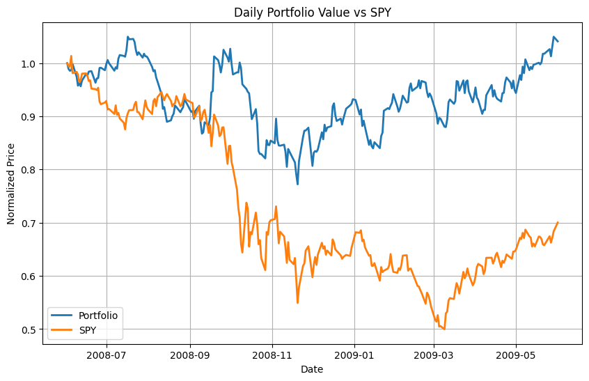

# Project 2: Optimize Something
# CS-7646

**Mohamed Deraz Nasr**  
**mnasr34**

---

## Introduction

This report shows portfolio optimization results using the Sharpe ratio. I optimized a portfolio of four stocks from June 2008 to June 2009: IBM, X (United States Steel), GLD (SPDR Gold Trust), and JPM (JPMorgan Chase).

The optimization finds fund allocations that maximize the Sharpe ratio. The Sharpe ratio measures risk-adjusted return. Higher values indicate better return per unit of risk.

---

## Optimization Method

I used SciPy minimize with the SLSQP method to find optimal allocations. The optimization maximizes the Sharpe ratio by minimizing its negative value. Constraints ensure allocations sum to 1.0 and each allocation falls between 0.0 and 1.0, allowing only long positions.

The Sharpe ratio uses 252 trading days per year, a risk-free rate of 0.0 per day, and sample standard deviation. The initial guess uses uniform allocation (0.25 for each stock).

---

## Results

### Figure 1: Optimal Portfolio vs SPY

Figure 1 compares the normalized performance of the optimized portfolio against SPY, the S&P 500 index. Both lines start at 1.0 on June 1, 2008, and show performance through June 1, 2009.

The portfolio outperforms SPY during this period. The portfolio line ends higher than the SPY line, indicating better returns. The portfolio shows different volatility patterns than the market index.

### Portfolio Statistics

The optimized portfolio allocations are:
- GLD: 76.7%
- JPM: 23.3%
- IBM: 0.0%
- X: 0.0%

Performance metrics:
- Cumulative Return: 4.10%
- Average Daily Return: 0.000851
- Standard Deviation of Daily Returns: 0.020836
- Sharpe Ratio: 0.6483

### Analysis

The optimization allocated most funds to GLD (76.7%) and JPM (23.3%). IBM and X received zero allocation. During the 2008-2009 period, the combination of gold and JPMorgan Chase provided the best risk-adjusted returns among these four assets.

The portfolio achieved a cumulative return of 4.10% with a Sharpe ratio of 0.6483. The Sharpe ratio indicates positive risk-adjusted returns, though the value suggests moderate performance relative to risk.

The chart shows the portfolio maintained a performance advantage over SPY throughout most of the period. This shows optimization can identify asset combinations that outperform the market index for specific time periods.

---
