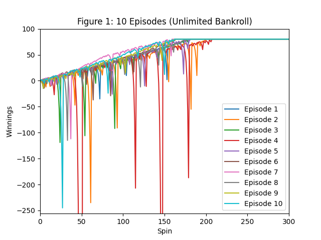
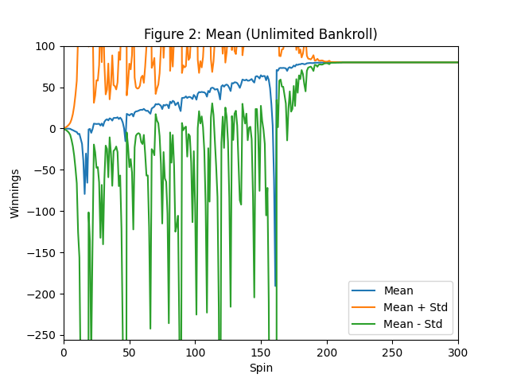
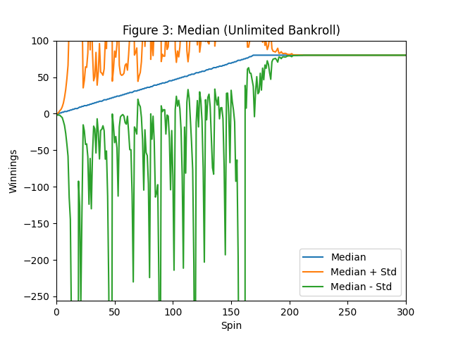
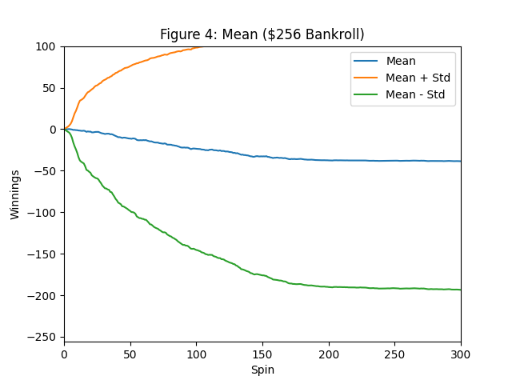
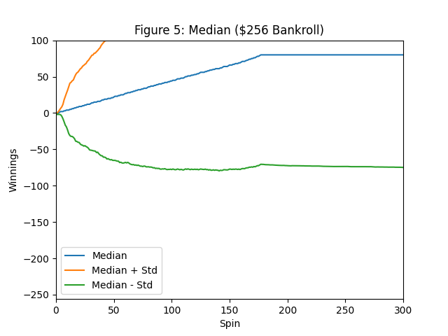

# Project 1: Martingale
# CS-7646

**Mohamed Deraz Nasr**  
**mnasr34**

---

## Introduction

This report presents the results of Monte Carlo simulations of the Martingale betting strategy on American roulette. The Martingale strategy is simple: bet $1 on black, double the bet after each loss, and reset to $1 after each win. The goal is to reach $80 in winnings. I ran two experiments: one with unlimited funds and one with a $256 bankroll limit.

American roulette has 38 slots: 18 black, 18 red, and 2 green (0 and 00). The probability of winning a bet on black is 18/38, or about 47.37%.

---

## Experiment 1: Unlimited Bankroll

In this experiment, the gambler has unlimited funds. I ran 1000 episodes, where each episode consists of up to 1000 spins. The simulation stops when the gambler reaches $80 in winnings.

### Figure 1: 10 Episodes

Figure 1 shows 10 episodes of the Martingale strategy. All episodes reach $80, though they take different paths. Some episodes have large dips before recovering.

### Figure 2: Mean with Standard Deviation

Figure 2 shows the mean winnings across 1000 episodes, with lines at mean + standard deviation and mean - standard deviation.

### Figure 3: Median with Standard Deviation

Figure 3 shows the median winnings across 1000 episodes, with the same standard deviation bands.

---

## Question 1: Probability of Winning $80 (Experiment 1)

**The probability of winning $80 is 1.0 (100%).**

I calculated this by counting how many of the 1000 episodes ended with winnings of $80 or more. All 1000 episodes reached the $80 target. This makes sense because with unlimited funds, the Martingale strategy will always recover from any losing streak. The gambler can keep doubling bets until a win occurs, which guarantees eventual profit.

The simulation data shows:
- Episodes that reached $80: 1000 out of 1000
- Probability: 1000/1000 = 1.0

---

## Question 2: Expected Value of Winnings (Experiment 1)

**The expected value of winnings after 1000 bets is $80.00.**

I calculated this by taking the mean of the final winnings across all 1000 episodes. Since every episode reached exactly $80 and stopped, the mean is $80.

The simulation data shows:
- Mean of final winnings: $80.00
- Standard deviation at spin 1000: 0.0

This result is misleading. It suggests the Martingale strategy is a guaranteed winner. However, this only works because we allowed unlimited funds. In reality, no gambler has infinite money.

---

## Question 3: Standard Deviation Behavior (Experiment 1)

**Do the standard deviation lines stabilize?** Yes. Both the upper (mean + std) and lower (mean - std) lines stabilize at $80 after about 200-250 spins.

**Do the standard deviation lines converge?** Yes. The lines converge to $80 and merge with the mean line.

**Explanation:** The standard deviation starts high because early in each episode, outcomes vary. Some gamblers are up, some are down. As more episodes reach the $80 target and stop betting, the variation decreases. By spin 200, almost all episodes have hit $80. At that point, the standard deviation drops to zero because all values are the same ($80).

The simulation data shows:
- Std at spin 50: 143.78
- Std at spin 100: 130.98
- Std at spin 200: 0.95
- Std at spin 300: 0.0

The standard deviation shrinks as episodes reach the target and fill forward with $80.

---

## Experiment 2: $256 Bankroll Limit

In this experiment, the gambler starts with $256. If the gambler loses all $256, they stop betting. This is more realistic.

### Figure 4: Mean with Standard Deviation

Figure 4 shows the mean winnings across 1000 episodes with the $256 bankroll limit.

### Figure 5: Median with Standard Deviation

Figure 5 shows the median winnings with the same standard deviation bands.

---

## Question 4: Probability of Winning $80 (Experiment 2)

**The probability of winning $80 is 0.634 (63.4%).**

I calculated this by counting how many of the 1000 episodes ended with winnings of $80 or more.

The simulation data shows:
- Episodes that reached $80: 634 out of 1000
- Episodes that lost $256: 365 out of 1000
- Probability of winning: 634/1000 = 0.634
- Probability of losing: 365/1000 = 0.365

Note that 634 + 365 = 999. One episode ended between -$256 and $80 (neither won nor lost completely within 1000 spins).

With a limited bankroll, the gambler cannot always recover from a bad losing streak. If the required bet exceeds the remaining funds, the gambler cannot double their way out.

---

## Question 5: Expected Value of Winnings (Experiment 2)

**The expected value of winnings after 1000 bets is -$42.77.**

I calculated this by taking the mean of the final winnings across all 1000 episodes.

The simulation data shows:
- Mean of final winnings: -$42.77
- Median of final winnings: $80.00

The negative expected value reveals the true nature of roulette. Despite winning 63.4% of the time, the gambler loses money on average. This happens because the losses are large ($256 each) while the wins are small ($80 each). The math works out:

- 63.4% win $80: 0.634 x $80 = $50.72
- 36.5% lose $256: 0.365 x (-$256) = -$93.44
- Expected value: $50.72 - $93.44 = -$42.72 (close to our simulated -$42.77)

The house edge makes the Martingale strategy a losing proposition in the long run.

---

## Question 6: Standard Deviation Behavior (Experiment 2)

**Do the standard deviation lines stabilize?** Yes. The upper line (mean + std) stabilizes around $119, and the lower line (mean - std) stabilizes around -$204.

**Do the standard deviation lines converge?** No. The lines do not converge. They remain far apart.

**Explanation:** Unlike Experiment 1, the outcomes in Experiment 2 do not cluster around a single value. Episodes end in one of two states: winning $80 or losing $256. This creates a bimodal distribution with high variance.

The simulation data shows:
- Std at spin 100: 122.04
- Std at spin 200: 152.47
- Std at spin 300: 154.84
- Std at spin 1000: 161.71

The standard deviation increases over time and then stabilizes at a high value. It does not decrease because episodes keep splitting into winners and losers. The distribution never narrows to a single outcome.

The median ($80) differs from the mean (-$42.77). This confirms the distribution is skewed. Most episodes win $80, but the losses are so large that they drag down the average.

---

## Question 7: Benefits of Expected Values

Using expected values instead of single episode results provides several benefits:

1. **Reduces noise.** A single episode might win or lose based on luck. The expected value averages out the randomness across many trials. This gives a clearer picture of the true outcome.

2. **Reveals the house edge.** A single lucky episode might show a $80 profit. But the expected value of -$42.77 shows that the strategy loses money over time. This is the real insight.

3. **Supports better decisions.** If a gambler only looked at one winning episode, they might think the strategy works. The expected value tells them otherwise. It is a more reliable basis for decisions.

4. **Measures risk.** Combined with standard deviation, expected values help quantify risk. A high standard deviation with a negative expected value is a bad combination.

5. **Enables comparison.** Expected values let us compare different strategies on equal footing. We can see which strategy has the best average outcome, not just the best single result.

In short, expected values turn random outcomes into useful statistics. They are essential for any serious analysis of betting strategies or investment decisions.

---

## Conclusion

The Martingale strategy appears to work with unlimited funds but fails with realistic constraints. With a $256 bankroll, the probability of winning drops to 63.4%, and the expected value becomes negative (-$42.77). The house edge in American roulette ensures that gamblers lose money over time, regardless of betting strategy.

---

## References

- Wikipedia: Roulette. https://en.wikipedia.org/wiki/Roulette
